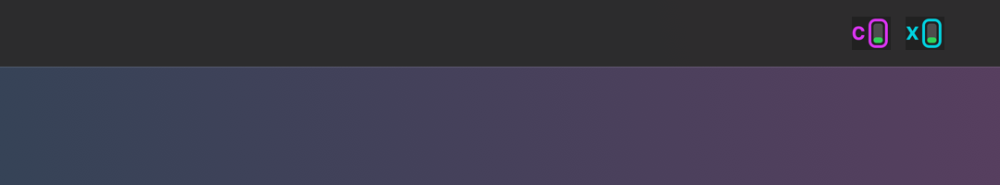
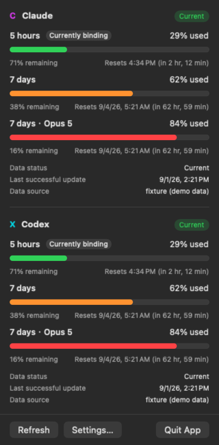
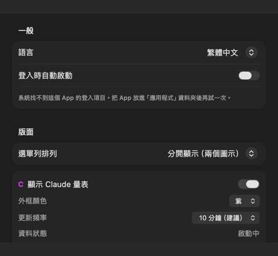
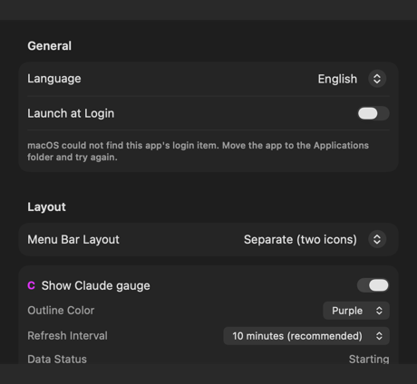

# Agent Usage Bar

[繁體中文](README.md) | **English**

A Claude and Codex usage meter for the macOS menu bar. See how much of your subscription allowance you have used without opening a usage page or typing a command.

> [!WARNING]
> Apple Silicon alpha release. Builds are ad-hoc signed and **not Apple-notarized**, so they do not carry an Apple-verifiable publisher identity. macOS is expected to require manual approval after downloading the app.
> Both usage readings come from local CLIs: Claude runs `claude -p "/usage"`, while Codex uses the read-only App Server interface. Claude embeds percentages in human-readable text rather than structured fields; if that format changes, the app shows “Unknown” instead of guessing.

> [!NOTE]
> **Known Claude issue:** In some cases, the background `/usage` query keeps showing “Response format changed” until the user launches `claude` once in Terminal. If this happens, launch Claude Code, complete any sign-in prompt, return to the app, and click Refresh. The app does not sign you in or repair credentials for you; see the Claude section below for details.

This project is not affiliated with or endorsed by Anthropic or OpenAI. All icons are original and do not use either company's official marks.

## Screenshots

<p align="center">
  
</p>

<p align="center"><sub>The separate-display menu-bar appearance. The gauges come from the app's production renderer; the clean synthetic background contains no real desktop information.</sub></p>

<p align="center">
  
</p>

<p align="center"><sub>Combined Claude and Codex usage in dark mode. Every number is synthetic demo data, not real account information.</sub></p>

<p align="center">
  
  
</p>

<p align="center"><sub>Settings can switch between Traditional Chinese and English. Both images use isolated synthetic preferences.</sub></p>

## What it does

Agent Usage Bar places a vertical liquid gauge in the menu bar. **The filled height is the percentage already used**—it rises as usage grows rather than shrinking as allowance runs out. Click it to see detailed values for each usage window.

Both providers already report “percentage used.” Converting that value again would only add confusion, so the number and the gauge communicate the same thing.

- The **outline color** identifies the provider and can be customized.
- The **fill color** represents usage (0–49% green, 50–79% orange, 80–99% red, and 100% red with stripes) and cannot be customized. Color depends only on the percentage, not on each provider's own severity label; otherwise the same orange would mean different things on adjacent gauges.
- The **letter on the left** (`C` / `X`) is a second identity cue that does not depend on color, so the providers remain distinguishable for color-blind users or when similar outline colors are selected.

When a provider **explicitly reports failure**, the app never presents old data as current. If a previous value exists, it is marked Stale with its fetch time; without trustworthy data, the app shows Unavailable. The design rule is that **unknown is never drawn as 0%**. The Codex decoder rejects out-of-range or non-integer percentages instead of clamping malformed input into a plausible-looking 0 or 100.

The app retains a visual rate-limited state, but neither current live path is guaranteed to deliver an explicit HTTP 429. Claude CLI may silently fall back to local cache, while Codex App Server may report a general typed error. A reliable recovery time therefore cannot be promised for every rate-limit event.

## Product scope: low permission, privacy first

Agent Usage Bar is not intended to be a complete AI usage analytics platform. It primarily answers: **how much of the current Claude or Codex subscription allowance has been used, and how many tokens has the Codex account used?** The app deliberately does not read or store `auth.json`, OAuth tokens, Keychain credentials, conversation transcripts, task JSONL, or local databases. It also does not provide multi-account switching, cross-device sync, or its own long-term tracking database.

The installed and signed-in official CLIs perform the queries: Claude runs a fixed read-only `/usage` command, while Codex uses the read-only App Server methods `account/rateLimits/read` and `account/usage/read`. The latter directly reports lifetime tokens, peak daily tokens, and daily buckets; the app does not reconstruct them by scanning local tasks. Only parsed UI values and the latest snapshot are retained. Sign-in, renewal, and credential storage remain the responsibility of the official tools.

This boundary is an intentional product tradeoff, not an unfinished feature list. The app gives up per-request and per-task token history, cached-token breakdowns, cost estimates, and multi-account management, but does not need the conversation content and login access those features would require. When an upstream format or data freshness cannot be trusted, the app shows Unknown instead of reading a more sensitive source to keep the UI populated.

## Current status

Both **Claude and Codex** are supported. They query, retry, and disable independently, so failure on one side does not block the other.

The app does not accumulate its own usage samples or forecast usage. Usage persistence contains settings and **only the latest reading for each provider**—one snapshot that is overwritten. A Codex snapshot may contain the daily buckets returned by `account/usage/read`, which the popover draws as a daily chart; that is provider-maintained account history, not a sequence collected by this app. Quota and token statistics retain independent fetch timestamps and update on independent schedules; a failure on one side does not erase the other side's trusted result. The chart shows 30 days by default and can be set to 5, 10, 15, 20, 30, or 60 days; this changes only the visible range and does not delete provider data from the snapshot. The popover also shows today's official bucket. If Codex has not reported today yet, it says “Not reported yet” instead of treating the missing value as zero. Settings also include a privacy-safe error history containing time, provider, an app-defined error category, and a closed app-defined detail reason. Each entry can be expanded and its full safe explanation copied. Raw responses and arbitrary provider text are never stored. Logs are retained for five days by default, configurable to three or seven days, and can be cleared at any time.

The latest snapshot exists to prevent excessive queries. Previously, every app launch immediately sent another request; closing and reopening the app ten times meant ten requests. The app now reuses the last reading on startup and refreshes quota or token statistics only after its respective interval has elapsed.

> [!IMPORTANT]
> Correctness, stability, and conservative code-reduction work are complete and pass the project's full verification suite. See [Verification](docs/VERIFICATION.md) for current coverage and evidence.

## App behavior

Agent Usage Bar normally runs as a menu-bar utility and **does not occupy the Dock**. Opening it from Launchpad or Finder—whether it is already running or not—opens Settings and temporarily shows the Dock icon. Closing Settings removes the Dock icon while the menu-bar gauges continue running.

If both providers are disabled, a neutral menu-bar icon remains as an entry point; otherwise Settings would become unreachable.

When menu-bar space is tight, especially on notched Macs, Settings can switch to **Combined Display**. Both gauges are drawn in one icon at half the width while keeping their letters and outline colors. Clicking the combined item shows readings for both providers.

The popover first expands to fit all content and enables scrolling only when the screen is genuinely too small. Reopening Settings moves the window to the current Space instead of taking the user back to the Space where it was previously opened.

The interface can switch between **Traditional Chinese and English** in Settings without following the macOS system language. The selection is saved and applies together to the popover, Settings, menus, and VoiceOver.

The app can also **launch at login**.

Settings → Diagnostic Logs shows the time and type of recent query failures. Expanding an entry reveals a complete app-generated explanation that can be copied. It never stores raw responses, credentials, executable paths, or arbitrary provider-supplied text, and it is capped at the latest 200 entries.

## Installation

Build the app yourself (see Development below), or download the DMG and matching `.sha256` from Releases and verify it first:

```bash
shasum -a 256 -c Agent-Usage-Bar-<version>-alpha.1-b<build>-<architecture>.dmg.sha256
```

Open the DMG and drag `AgentUsageBar.app` into Applications.

The app is ad-hoc signed and not Apple-notarized, so it has no Apple-verifiable publisher identity. `spctl` reports `rejected` on the build machine. After an Internet download, macOS is expected to block a normal double-click and report that Apple cannot verify the app for malicious software. On newer macOS versions, the first dialog may offer only Move to Trash and Cancel.

To allow the app:

1. Double-click it once so macOS records the blocked launch.
2. Open **System Settings → Privacy & Security** and scroll down.
3. Find the message that AgentUsageBar was blocked and click **Open Anyway**.
4. Confirm once more.

Older macOS versions may also support the Control-click → Open shortcut; newer versions have removed it.

> [!NOTE]
> These steps have not yet been completed on an independent clean Mac. Signing and DMG verification pass on the build machine, and `spctl` rejects the current unnotarized artifact as expected. The complete browser-download experience with a quarantine attribute still needs validation on another Mac.

A `.sha256` proves only that the DMG bytes match the checksum you obtained. The checksum must come from a trusted or independent channel to be meaningful and cannot replace the publisher identity provided by Developer ID signing and Apple notarization.

Requirements: macOS 14 or later, Apple Silicon, and a locally installed and signed-in Claude Code and/or Codex CLI for each enabled provider.

## Where the data comes from

### Claude

The app runs Claude Code's own read-only command and parses the values it reports:

```bash
claude --safe-mode --no-session-persistence -p "/usage" --output-format json
```

Observed runs do not invoke a model or consume conversation allowance (`num_turns=0`, with every token count at zero). `--safe-mode` reuses the existing sign-in while avoiding hooks, plugins, MCP, and project settings. `--no-session-persistence` prevents this invocation from leaving a session behind.

**The app does not read your Keychain credentials.** The earlier direct OAuth/Keychain prototype has been completely removed; the public version contains no such path or automatic fallback. Claude Code remains responsible for sign-in and credential renewal.

The argument list is a fixed constant. It cannot be changed in Settings or influenced by any response. Verification guards reject shell execution and `doctor`, `mcp`, `auth`, or `login`, and compare the exact approved argument list.

#### Known issue: Claude Code may need to be launched once

On one real machine, the background `/usage` query repeatedly returned content the app could not recognize. The UI therefore showed “Response format changed” and retained the previous reading. Launching interactive `claude` once in Terminal and then clicking Refresh restored normal operation. Incomplete sign-in, renewal, or local-state initialization are plausible explanations, but only the symptom and workaround have been observed; no official documentation confirms the root cause.

If this happens:

1. Click Copy Command in the app's error message, or type `claude` in Terminal yourself.
2. Complete sign-in if Claude Code asks. If it opens directly into the interactive interface, confirm that it launches normally and then exit.
3. Return to Agent Usage Bar, wait for the 20-second request-spacing interval, and click Refresh.

The app intentionally does not launch an interactive CLI automatically, perform sign-in, or read or modify credentials. If the steps above do not restore service, open Settings → Diagnostic Logs, expand the latest entry, and copy the app-generated safe explanation into an issue. Do not post Keychain contents, tokens, or Claude's complete raw response.

### Data freshness

When connected, `/usage` updates its data. When offline, it **silently falls back to Claude Code's local cache**. In one controlled observation on August 28, 2026, a Wi-Fi-only Mac still returned the previous window's complete stale data after Wi-Fi was disabled and the known reset time passed. Only another query after Wi-Fi was restored returned the new window. Command duration cannot prove connectivity because observed online and offline times overlapped, and the output itself does not include the time when the data was obtained.

The app therefore treats reset time as a freshness boundary. Before reset, a cache entry still belongs to the current window. After reset, it describes a window that has ended and is shown as Unavailable instead of as a percentage.

This guard applies independently to both required session and weekly windows. If either window has passed its reset time, the complete reading is unavailable. The IANA timezone named by the CLI must also be recognized; the app never guesses using the Mac's local timezone.

**What the guard cannot detect is lag within an active window.** In the worst case, a session number may be up to five hours old while still appearing normal. This is a real tradeoff of moving to the CLI `/usage` path and is documented rather than hidden.

### Credentials and sign-in

The app **does not sign in, start a sign-in flow, or write credentials**. When Claude Code is signed out, the panel offers `claude` for the user to run in Terminal. It does not offer that command when the executable is missing or too old, because those cases require installation or an update instead.

More precisely, the app no longer **reads** credentials, but its online command needs a valid ticket. Claude Code may renew that ticket while handling the invocation. Saying that the app “never touches credentials” would therefore be imprecise.

GUI apps often have a different `PATH` from Terminal. Settings → Data Sources can specify the `claude` executable; leaving it blank checks common installation locations and the current environment in order. The app verifies only that the path is executable and does not authenticate the vendor identity of a third-party or substituted binary. Select only a Claude Code installation you trust.

### Refresh interval

Quota defaults to **10 minutes** (about 144 updates per day), configurable to 1, 3, 5, 10, 30, or 60 minutes. Codex token statistics have an independent interval, defaulting to **1 hour**, with choices of 15 or 30 minutes and 1, 2, 3, or 6 hours. App Server quota notifications can still update the display between polls. Refresh requests both quota and token statistics. Both schedules obey the 20-second anti-repeat floor and pause during sleep, display sleep, and lock.

Version 0.3.1 lowered the default from 30 minutes. The old path sent requests directly from the app and controlled its own retries, so rate limiting could trap it in a loop. The current request is performed by Claude Code itself, removing that particular failure mode from the app.

**Short intervals are still discouraged because of feedback quality, not because they are inherently dangerous.** When rate-limited, the CLI may silently return cache just as it does offline. Excessive polling may produce no error at all—only an old number without an explanation. Since the shortest usage window is five hours, querying every minute is not meaningfully more useful than querying every ten minutes.

Polling pauses while the Mac sleeps or while the display is off or locked. It resumes and attempts an update after wake or unlock. `FetchPacing` still enforces a 20-second anti-repeat floor and may reuse a reading that remains inside the selected refresh interval.

### Codex

The app starts the local Codex CLI's App Server directly:

```text
codex app-server --listen stdio://
```

Over JSONL, the app sends only initialization, `account/rateLimits/read`, and `account/usage/read`, and accepts `account/rateLimits/updated` notifications. Token totals and daily values come directly from the official account-usage response; the app does not parse tasks, and the response does not expose a cached-input-token breakdown. It does not read `auth.json`, task JSONL, SQLite, or caches, and it implements no method for login, logout, purchases, email, or consuming reset credits.

App Server is one long-lived child process, not a new process for every refresh. Disabling Codex, changing its CLI path, or quitting the app terminates only the exact process created by this app. If normal termination fails, the app waits briefly and then force-stops only that same process. Quota uses a ten-minute safety query by default; token statistics default to one hour. Push notifications update only the quota fields they actually provide; they do not clear weekly usage, Credits, plan, or token statistics, and do not postpone either schedule. If a read times out, the app discards the old connection and initializes a new one on the next attempt; a healthy connection stays alive. OpenAI has not published a minimum interval or fixed penalty window for these read-only queries. The defaults are this app's conservative choices, not official limits.

Because a GUI app's `PATH` often differs from Terminal, Settings → Data Sources can specify the Codex executable. Leaving it blank checks common installation locations and the current environment in order. The app verifies only that the path is executable, not its vendor signature; select only a Codex installation you trust. The query does not trigger model inference or consume ordinary Codex conversation allowance.

## Development

```bash
open macos/AgentUsageBar/App/AgentUsageBar/AgentUsageBar.xcodeproj
```

Select the `AgentUsageBar` scheme and `My Mac`, then click Run.

```text
macos/AgentUsageBar/          Swift package root
├── Package.swift
├── Sources/
│   ├── AgentUsageBar/        App layer; Debug also contains synthetic render/self-test scenarios
│   └── UsageMeterCore/       UI-independent logic with standalone tests
├── Tests/UsageMeterCoreTests/
└── App/AgentUsageBar/
    ├── AgentUsageBar.xcodeproj
    └── AgentUsageBar/        Info.plist and Resources/AppIcon.icns
```

The Xcode target references `Sources/AgentUsageBar` through a synchronized folder, so new files automatically belong to the target. This avoids the “Swift build passes but the app cannot see the file because target membership was missed” failure mode.

Verification:

```bash
./scripts/verify.sh
```

This is the project's single verification entry point. It runs unit tests, the actual Xcode app target, `NSStatusItem` diagnostics, SwiftUI renders, and static guards.

Diagnostics never run under the production app identity. The script copies a temporary app, assigns a unique bundle identifier, ad-hoc signs it, and then runs self-tests and renders. It compares an anonymous fingerprint of production settings before and after. Test preferences are always removed, and the temporary app is moved to Trash when the system `trash` command is available; otherwise the retained path is reported explicitly. See [VERIFICATION.md](docs/VERIFICATION.md) for details.

DMG packaging:

```bash
./scripts/package_dmg.sh --preflight
./scripts/release.sh plan
```

Both `preflight` and `plan` are read-only. After a maintainer approves the plan, `release.sh prepare` creates a real candidate: it commits one version file, runs complete verification, and creates a mutually bound DMG, checksum, and candidate manifest. Existing files are never overwritten, and an exact manifest creates the tag only after human installation testing. **These scripts never install, push, or create a remote Release.** See [docs/PACKAGING.md](docs/PACKAGING.md) for the complete process.

See [docs/SIGNING.md](docs/SIGNING.md) for signing configuration.

## Documentation

- [Contributing](CONTRIBUTING.md) — development environment, verification, and pull-request rules
- [Security policy](SECURITY.md) — vulnerability reporting, security boundaries, and accepted risks
- [Architecture](docs/ARCHITECTURE.md) — layers, directory structure, and the providers' shared contract and intentional differences
- [Safety](docs/SAFETY.md) — read-only boundaries, freshness guards, rate-limit safety, and known unverified items
- [UI spec](docs/UI_SPEC.md) — the gauge visual language shared by both providers
- [Claude usage source](docs/CLAUDE_USAGE.md) — fixed read-only command, text format, and failure strategy
- [Codex usage source](docs/CODEX_USAGE.md) — App Server protocol, fields, and failure strategy
- [Retired Keychain path](docs/LEGACY_KEYCHAIN_PATH.md) — lessons from the old credential-and-endpoint approach and when it might be reconsidered
- [What did not work](docs/WHAT_DID_NOT_WORK.md) — rejected decisions and lessons learned
- [Verification](docs/VERIFICATION.md) — what is checked and why those guards exist
- [Packaging](docs/PACKAGING.md) — DMG packaging and release process
- [Signing](docs/SIGNING.md) — what free and paid signing identities actually provide
- [Roadmap](docs/ROADMAP.md)

## License

Licensed under the [Apache License 2.0](LICENSE). Copyright and attribution information is available in [NOTICE](NOTICE).
